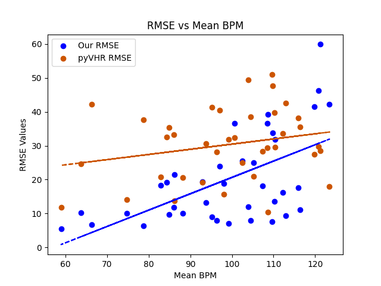

# OBS Plugin: PulseOBS - Webcam Based Heart Rate Monitoring for Live Streamers
PulseOBS is a plugin that measures your heart rate directly using your webcam and facial detection. It supports both macOS and Windows.

## Introduction

PulseOBS is designed to help live streamers monitor their heart rate without the need for wearable devices. Currently, it supports heart rate measurement for a single person visible in the webcam feed.

> **Note:** This plugin should not be used for medical purposes and does not provide any medical advice.

> **Warning:** This plugin consumes significant CPU resources.

## Download

### Windows
(TODO: Add download link and instructions)

### MacOs
Download the installation package from (TODO: Add link).

1. Double-click PACKAGE_NAME.pkg to open the installer.

2. Follow the on-screen instructions to complete the installation.

3. The plugin will be installed in:
    ```
    /Users/<user_name>/Library/Application\ Support/obs-studio/plugins
    ```

### OBS Version Support and Compatibility
PulseOBS supports the latest OBS version 31.0.1.

## Quick Start

1. Add a `Video Capture Device` as a source in OBS Studio.

2. Select `Video Capture Device` and click `Filters`.

3. Under `Effect Filters`, select `Heart Rate Monitor`.

4. Click `Heart Rate Monitor` to configure settings.

5. The heart rate can be displayed as a text source or a graph source.

## Suggested Setting Combination
Optimal Accuracy: We shall see

Low Resource Consumption:  Advanced Algorithm (with face tracking) and PCA

## Support and Feedback

For assistance, please contact: pulseobs@gmail.com

To report bugs or suggest features, open an issue at [here](https://github.com/Maciek03102003/PulseOBS/issues).

## Technical Details

### Heart Rate Calculation
PulseOBS provides multiple algorithms to calculate heart rate:
| Method name    |  Reference paper |
| ------------ | ---------------------------------------------------------------------- |
|Green    | Verkruysse, W., Svaasand, L. O., & Nelson, J. S. (2008). Remote plethysmographic imaging using ambient light. Optics express, 16(26), 21434-21445.|
|CHROM    | De Haan, G., & Jeanne, V. (2013). Robust pulse rate from chrominance-based rPPG. IEEE Transactions on Biomedical Engineering, 60(10), 2878-2886.|
|PCA      | Lewandowska, M., Rumiński, J., Kocejko, T., & Nowak, J. (2011, September). Measuring pulse rate with a webcam—a non-contact method for evaluating cardiac activity. In 2011 federated conference on computer science and information systems (FedCSIS) (pp. 405-410). IEEE.|

### Filtering
Pre and Post Filtering methods are used to improve accuracy:

Pre-Filtering:
- Bandpass
- Detrending
- Zero Mean

Post-Filtering:
- Bandpass

### Face Detection and Tracking
PulseOBS uses face detection and tracking to optimize processing speed and improve accuracy. Available face detection methods:

- Basic Algorithm
    - Uses OpenCV Haar Cascade

- Advanced Algorithm
    - Uses dlib HoG (with and without face tracking)
    - Face detection is performed every 60 frames.
    - Face tracking is used between detections to enhance performance.

## Evaluation
All PPG, filtering and face detection combinations were tested on the UBFC2 dataset [2], comparing to the ground truth and values generated by the python library pyVHR [1], a library for studying methods of pulse rate estimation from videos. Our PCA algorithm achieved consistently better performance, with and without filtering, compared to the implementation in pyVHR, which can be seen here:



## References
```
[1] Boccignone, G., Conte, D., Cuculo, V., D’Amelio, A., Grossi, G. and Lanzarotti, R., 2025. Enhancing rPPG pulse-signal recovery by facial sampling and PSD Clustering. Biomedical Signal Processing and Control, 101, p.107158.
```
```
[2] S. Bobbia, R. Macwan, Y. Benezeth, A. Mansouri, J. Dubois, "Unsupervised skin tissue segmentation for remote photoplethysmography", Pattern Recognition Letters, 2017.
```
