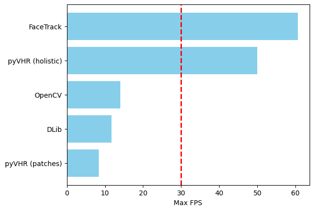

# OBS Plugin: StreamMyHeart - Webcam Based Heart Rate Monitoring for Live Streamers
StreamMyHeart is a plugin that measures your heart rate directly using your webcam and facial detection. It supports both MacOS and Windows.

## Introduction

StreamMyHeart is designed to help live streamers monitor their heart rate without the need for wearable devices. Currently, it supports heart rate measurement for a single person visible in the webcam feed.

> **Note:** This plugin should not be used for medical purposes and does not provide any medical advice.


## Download
Download the latest installation packages from [here](https://github.com/Maciek03102003/StreamMyHeart/releases).

### Windows
1. Double-click `.exe` file to open the installer.

2. Follow the instructions to complete installation.

3. To uninstall the plugin, use the uninstaller located in the OBS application folder.

> **Note:** If OBS Studio was open during the installation, please restart it for the plugin to load.

### MacOS
1. Double-click `.pkg` file to open the installer.

2. Follow the on-screen instructions to complete the installation.

3. The plugin will be installed in:
    ```
    /Users/<user_name>/Library/Application\ Support/obs-studio/plugins
    ```

> **Note:** If OBS Studio was open during the installation, please restart it for the plugin to load.

### OBS Version Support and Compatibility
StreamMyHeart supports the latest OBS version 31.0.1.

## Quick Start

1. Add a `Video Capture Device` as a source in OBS Studio.

2. Select `Video Capture Device` and click `Filters`.

3. Under `Effect Filters`, select `Heart Rate Monitor`.

4. Click `Heart Rate Monitor` to configure settings.

5. The heart rate can be displayed as a text source or a graph source.

## Suggested Setting Combination

### Optimal Accuracy (Default)
- Advanced Algorithm (with face tracking)
- Zero Mean
- Chrom
- Post Filtering On

### Low Resource Consumption
- Advanced Algorithm (with face tracking)
- None
- Green
- None

## Support and Feedback

For assistance, please contact: streammyheart.team@gmail.com

To report bugs or suggest features, open an issue at [here](https://github.com/Maciek03102003/StreamMyHeart/issues).

## Technical Details

### Heart Rate Calculation
StreamMyHeart provides multiple algorithms to calculate heart rate:
| Method name    |  Reference paper |
| ------------ | ---------------------------------------------------------------------- |
|Green    | Verkruysse, W., Svaasand, L. O., & Nelson, J. S. (2008). Remote plethysmographic imaging using ambient light. Optics express, 16(26), 21434-21445.|
|CHROM    | De Haan, G., & Jeanne, V. (2013). Robust pulse rate from chrominance-based rPPG. IEEE Transactions on Biomedical Engineering, 60(10), 2878-2886.|
|PCA      | Lewandowska, M., Rumiński, J., Kocejko, T., & Nowak, J. (2011, September). Measuring pulse rate with a webcam—a non-contact method for evaluating cardiac activity. In 2011 federated conference on computer science and information systems (FedCSIS) (pp. 405-410). IEEE.|

### Filtering
Pre and Post Filtering methods are used to improve accuracy:

Pre-Filtering:
- Bandpass
- Detrend
- Zero Mean

Post-Filtering:
- Bandpass

### Face Detection and Tracking
StreamMyHeart uses face detection and tracking to optimize processing speed and improve accuracy. Available face detection methods:

- Basic Algorithm
    - Uses OpenCV Haar Cascade

- Advanced Algorithm
    - Uses dlib HoG (with and without face tracking)
    - Face detection is performed every 60 frames.
    - Face tracking is used between detections to enhance performance.

## Evaluation
All PPG, filtering and face detection combinations were tested on the UBFC2 dataset [2], comparing to the ground truth and values generated by the python library pyVHR [1], a library for studying methods of pulse rate estimation from videos. Our PCA algorithm achieved very comparable, and even better performance, with and without filtering, compared to the implementation in pyVHR, which can be seen here:


Furthermore, our most optimal combination that is mentioned above, greatly outperforms this baseline implementation used by pyVHR, which is clear in the below graph:


Face detection is the most time-consuming part of the algorithm, and its performance has the biggest impact on the overall performance of the plugin. The graph below shows the time taken by different parts of the algorithm, highlighting the significant contribution of face detection to the total processing time:


Given the significant impact of face detection on the overall performance, we focused on evaluating the maximum frames per second (FPS) that the algorithm is able to process with different face detection methods. The plugin is capable of processing up to 60 FPS when face tracking is enabled, providing both high accuracy and smooth performance. In contrast, using the OpenCV Haar Cascade method or dlib HoG without face tracking results in a significantly lower maximum FPS of around 10 to 15. This difference in performance is summarised in the graph below, together with the performance of the pyVHR face detection techniques:



## References
```
[1] Boccignone, G., Conte, D., Cuculo, V., D’Amelio, A., Grossi, G. and Lanzarotti, R., 2025. Enhancing rPPG pulse-signal recovery by facial sampling and PSD Clustering. Biomedical Signal Processing and Control, 101, p.107158.
```
```
[2] S. Bobbia, R. Macwan, Y. Benezeth, A. Mansouri, J. Dubois, "Unsupervised skin tissue segmentation for remote photoplethysmography", Pattern Recognition Letters, 2017.
```
